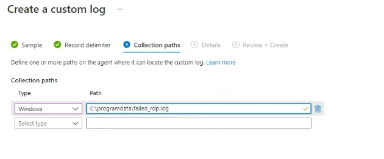

# RDP Detection With Azure Honeynet
---
- RDP Client - https://github.com/FreeRDP/FreeRDP
- KQL Documentation - https://docs.microsoft.com/en-us/azure/data-explorer/kusto/query/
- Geo Location API - https://ipgeolocation.io

In this lab, we outline the meticulous process of setting up a honeynet environment on `Microsoft Azure`. The initial steps involve creating a Windows virtual machine accessible to the internet, configuring network security settings, and establishing a `Log Analytics workspace`. The process includes making the virtual machine easily discoverable by allowing `ICMP` traffic, monitoring security events through custom logs and `PowerShell` scripts, and extracting geographical information from failed `RDP` attempts. The culmination of these efforts is showcased through `Azure Sentinel`, Microsoft's native `Security Information and Event Management (SIEM)` solution, providing a powerful visualization of potential threats on a world map. This robust setup can give valuable insights and show potential attack patterns.

Below is a screenshot of the finished map result.


## Creating Honeypot Machine
---
Let's start by creating a virtual machine that will be exposed to the internet. Navigating to `portal.azure.com` we can search for `Virtual machines` and click on the service. We can create a virtual machine by clicking on `Create` on the top left of the page.

At this point, we can create a new resource group by clicking `Create new` below the `Resource group` field. In this example, we named the resource group `Honeypot-lab`. We will also set `Honeypot-vm` as the name for the Windows virtual machine.


---
Below we specify the `username` and `password` of the administrator account and proceed by checking the required boxes in the `Licensing` area and moving on to the next steps.


---
On the `Networking` section we will first set `NIC network security group` to `Advanced` and click on `Create new` below the `Configure network security group` field.


---
Once here, we can remove the default rule and add our own by clicking on `+ Add an inbound rule`. The new rule is set to a priority of `100` and will allow any inbound traffic to the virtual machine. This will aid in the process of discovery for our honeypot machine.


---
We can now click on `OK` and skip to the `Review + create` process where we can click `Create` to finish creating the Windows virtual machine.


## Creating Log Analytics Workspace
---
While the VM is initializing, we can navigate to the `Log Analytics workspace` service by typing the respective name into the search bar. This log analytics workspace will be used to ingest the custom log file from the virtual machine.

To create the workspace, we will click `Create` on the top left of the page. Once in the `Basics` section, we will name it `law-honeypot` and choose the `Honeypot-lab` resource group. We can proceed to `Review + Create` and then click `Create` to finish.


---
Now, let's connect the `law-honeypot` workspace to the `Honeypot-vm` machine by navigating back to the `Log Analytics workspace` service and selecting law-honeypot. We can move over to the `Virtual machines` section and add the `Honeypot-vm` by selecting it and clicking on `Connect` at the top left.


## Enabling Logs
---
Moving on, we can search for the `Microsoft Defender for Cloud` service, and navigate to `Environment settings` where we can select the `law-honeypot` workspace. Here we can turn on the `Servers` defender plan. The `SQL servers on machines` plan is not necessary for the lab so we will keep it off. We can now `Save` the changes on the top left.


---
To receive event logs from the Windows VM we need to navigate to `Data collection` on the left and enable `All Events` to accept all Windows security events. We can now `Save` the changes on the top left to finish.


## Allowing ICMP
---
We can now remote into the virtual machine with the `RDP` client of our choosing. Using the previously supplied credentials we can login to the `Honeypot-vm` machine using the public IP of `20.168.12.215`. This information is provided in the `Virtual machines` service.


---
It is important to note `ICMP` packets to this machine are `dropped`. This is not ideal as we would like the machine to easily be found by attackers on the internet. We can do this by allowing pings through the internal `firewall` of the virtual machine.


---
After logging in to the machine, we can start by `disabling` the `firewall` to allow the machine to be further discoverable on the internet. You would normally just allow `ICMP` traffic to achieve this, nonetheless we are disabling the firewall for this example since this is a honeypot machine.


---
After disabling the `firewall` the machine no longer drops `ICMP` traffic and easily lets us know it exists.


## Collecting Logs With PowerShell
---
Looking in `Event Viewer` we can see security-related logs in the `Security` section. We will be taking advantage of these logs to gather information on RDP brute force attempts to the Windows machine, more specifically the `public IP` of the attackers. Here we supplied a fake username of `test_fail` and fake password to demonstrate a security log.


---
We can now open the `Windows PowerShell ISE` application in the honeypot machine. We will be using the following `PowerShell` script that will essentially feed the `IP` of failed RDP logins obtained during new security events and supply it to the `ipgeolocation.io` API. Thus, allowing us to gather geographical information.

```powershell
# Configuration
$API_KEY      = "d3s00bm4fdez4gb39c98f5155n41a4d7"
$LOGFILE_NAME = "failed_rdp.log"

# Create log file
$LOGFILE_PATH = "C:\ProgramData\$($LOGFILE_NAME)"

if ((Test-Path $LOGFILE_PATH) -eq $false) {
    New-Item -ItemType File -Path $LOGFILE_PATH
    write-Sample-Log
}

# Failed RDP security event log filter
$XML_RDP_Filter = @'
<QueryList> 
   <Query Id="0" Path="Security">
         <Select Path="Security">
              *[System[(EventID='4625')]]
          </Select>
    </Query>
</QueryList> 
'@

# Check for new event logs
while ($true)
{
    Start-Sleep -Seconds 1
    # Obtain events that match XML filter
    $events = Get-WinEvent -FilterXml $XML_RDP_Filter -ErrorAction SilentlyContinue

    # Loop through events and create custom logs utilizing API to obtain gelocation
    foreach ($event in $events) {
    
        # Check if IP of failed logon is valid
        if ($event.properties[19].Value.Length -ge 5) {

            $timestamp = $event.TimeCreated
            $year = $event.TimeCreated.Year
            $month = $event.TimeCreated.Month
            
            if ("$($event.TimeCreated.Month)".Length -eq 1) {
                $month = "0$($event.TimeCreated.Month)"
            }

            $day = $event.TimeCreated.Day
            if ("$($event.TimeCreated.Day)".Length -eq 1) {
                $day = "0$($event.TimeCreated.Day)"
            }
            
            $hour = $event.TimeCreated.Hour
            if ("$($event.TimeCreated.Hour)".Length -eq 1) {
                $hour = "0$($event.TimeCreated.Hour)"
            }

            $minute = $event.TimeCreated.Minute
            if ("$($event.TimeCreated.Minute)".Length -eq 1) {
                $minute = "0$($event.TimeCreated.Minute)"
            }

            $second = $event.TimeCreated.Second
            if ("$($event.TimeCreated.Second)".Length -eq 1) {
                $second = "0$($event.TimeCreated.Second)"
            }

            $timestamp = "$($year)-$($month)-$($day) $($hour):$($minute):$($second)"
            $eventId = $event.Id
            $destinationHost = $event.MachineName# Destination host name
            $username = $event.properties[5].Value # Account name
            $sourceHost = $event.properties[11].Value # Source host name
            $sourceIp = $event.properties[19].Value # IP address
        

            # Get custom log file contents
            $log_contents = Get-Content -Path $LOGFILE_PATH

            # Check if log already exists
            if (-Not ($log_contents -match "$($timestamp)") -or ($log_contents.Length -eq 0)) {
 
                Start-Sleep -Seconds 1

                # Create url for geolocation API
                $API_ENDPOINT = "https://api.ipgeolocation.io/ipgeo?apiKey=$($API_KEY)&ip=$($sourceIp)"
                
                # Call the geolcation API
                $res = Invoke-WebRequest -UseBasicParsing -Uri $API_ENDPOINT

                # Retrieve information from API
                $responseData = $res.Content | ConvertFrom-Json
                $latitude = $responseData.latitude
                $longitude = $responseData.longitude
                $state_prov = $responseData.state_prov
                $country = $responseData.country_name
                
                # Convert empty output to null text
                if ($latitude -eq "") { $latitude -eq "null" }
                if ($longitude -eq "") { $longitude -eq "null" }
                if ($state_prov -eq "") { $state_prov -eq "null" }
                if ($country -eq "") { $country -eq "null" }

                # Create log string
                $log = "latitude:$($latitude),longitude:$($longitude),destinationhost:$($destinationHost),username:$($username),sourcehost:$($sourceIp),state:$($state_prov),country:$($country),label:$($country) - $($sourceIp),timestamp:$($timestamp)" 
                
                # Write entry to custom log file
                $log | Out-File $LOGFILE_PATH -Append -Encoding utf8

                Write-Host -BackgroundColor Black -ForegroundColor Magenta $log
            }
        }
    }
}
```

---
We can paste the contents of the PowerShell script to a file named `Logger.ps1` and run it. It generates the `failed_rdp` log file at `C:\ProgramData\failed_rdp` and starts listening for new `security event` logs. To try it, we will attempt to RDP into the honeypot machine with bogus usernames and passwords. As you can see this generates entries for every attempt and successfully retrieves geographical information from the IP.

| latitude | longitude | destinationhost | username | sourcehost | state | label | timestamp |
|---|---|---|---|---|---|---|---|
| 28.12752 | -81.46218 | Honeypot-vm | testfail-1 | 47.204.34.87 | Florida | United States - 47.204.34.87 | timestamp:23-12-10 01:56:47 |
| 28.12752 | -81.46218 | Honeypot-vm | testfail-2 | 47.204.34.87 | Florida | United States - 47.204.34.87 | timestamp:23-12-10 03:06:53 |


## Adding The Custom Log
---
Moving on to our local machine, we can `create` a file named `failed_rdp.log` with the following contents. We will use this later to supply sample log information during custom log creation in the `law-honeypot` workspace.

```
latitude:47.91542,longitude:-120.60306,destinationhost:samplehost,username:fakeuser,sourcehost:24.16.97.222,state:Washington,country:United States,label:United States - 24.16.97.222,timestamp:2021-10-26 03:28:29
latitude:-22.90906,longitude:-47.06455,destinationhost:samplehost,username:lnwbaq,sourcehost:20.195.228.49,state:Sao Paulo,country:Brazil,label:Brazil - 20.195.228.49,timestamp:2021-10-26 05:46:20
latitude:52.37022,longitude:4.89517,destinationhost:samplehost,username:CSNYDER,sourcehost:89.248.165.74,state:North Holland,country:Netherlands,label:Netherlands - 89.248.165.74,timestamp:2021-10-26 06:12:56
latitude:40.71455,longitude:-74.00714,destinationhost:samplehost,username:ADMINISTRATOR,sourcehost:72.45.247.218,state:New York,country:United States,label:United States - 72.45.247.218,timestamp:2021-10-26 10:44:07
latitude:33.99762,longitude:-6.84737,destinationhost:samplehost,username:AZUREUSER,sourcehost:102.50.242.216,state:Rabat-Salé-Kénitra,country:Morocco,label:Morocco - 102.50.242.216,timestamp:2021-10-26 11:03:13
latitude:-5.32558,longitude:100.28595,destinationhost:samplehost,username:Test,sourcehost:42.1.62.34,state:Penang,country:Malaysia,label:Malaysia - 42.1.62.34,timestamp:2021-10-26 11:04:45
latitude:41.05722,longitude:28.84926,destinationhost:samplehost,username:AZUREUSER,sourcehost:176.235.196.111,state:Istanbul,country:Turkey,label:Turkey - 176.235.196.111,timestamp:2021-10-26 11:50:47
latitude:55.87925,longitude:37.54691,destinationhost:samplehost,username:Test,sourcehost:87.251.67.98,state:null,country:Russia,label:Russia - 87.251.67.98,timestamp:2021-10-26 12:13:45
```

---
Now that we are constantly listening for security events and updating the log file, we can move on to properly receiving this information via a `custom log` in our `Log Analytics workspace`. In the service, we select the `law-honeypot` workspace and go to `Tables` where `New custom log (MMA-based)` can be chosen from the `Create` menu.


---
In the `Select a sample log` field we can select the sample log file we had created earlier named `failed_rdp.log` to continue with the next steps.


---
In the `Record delimiter` section we can see our sample logs. We will leave the `Select record delimiter` set to `New line` and proceed to the next step.


---
Here, it is asking where the custom log file is located in the virtual machine. This must be set correctly to `C:\programdata\failed_rdp.log` for example. This is the custom log file we know to be present in the Windows honeypot machine.



---
In the `Details` section, we supply a custom log name of `FAILED_RDP_CL` and click next. Now we can review our configurations and click `Create`. After creation, we will be able to digest the custom logs at the specified location inside the VM and any new entries added to that file. This can be referenced using `FAILED_RDP_CL` in `KQL`. The `_CL` suffix stands for custom log and is automatically added to distinguish custom logs from others.


---
We can retrieve our custom logs in `KQL` by referencing `FAILED_RDP_CL`. To format the data correctly, we will `parse` it to extract fields from the `RawData` column and then `project` those fields into a table.

```sql
FAILED_RDP_CL
| parse RawData with * "latitude:" Latitude ",longitude:" Longitude ",destinationhost:" DestinationHost ",username:" Username ",sourcehost:" SourceHost ",state:" State ",country:" Country ",label:" Label ",timestamp:" Timestamp
| project Latitude, Longitude, DestinationHost, Username, SourceHost, State, Country, Label, Timestamp
```


## Receiving RDP Attacks
---
Taking a peek at our virtual machine it is clear attackers have already found the honeypot and are attempting to brute force RDP with random usernames and passwords. One of these attempts is coming from Nuevo Lean in Mexico with a username of `CONTABILIDAD` which is obviously incorrect.


## Failed RDP Attempt Map
---
Now let's settup `Azure Sentinel` which is Microsoft's native `SIEM` solution. In the service, we can select the `law-honeypot` workspace. Once selected, we will click on the blue `Add` button at the bottom left.


---
Once added, we now have all the ingredients we need to create a world map. Armed with this much geographically accurate data, creating a world map highlighting the location of attackers will be quick and easy. We can do this by navigating to `Microsoft Sentinel` and selecting the previously enabled `law-honeypot` workspace. Next, we can go to `Workbooks` and click on `Add workbook` at the top left.


---
On the new workbook, we will click `edit` on the top left and `delete` the default widgets. Great, now let's add our own widget by clicking on `Add` on the middle left of the page and selecting `Add query` from the drop-down menu. 


---
Now we can write the following query to ensure sample logs and blank sourcehost's don't enterfear with our results. We will make sure to set `Visualization` to `Map` on the `Settings` section which will open the configuration window for the `Map Settings`.

```sql
FAILED_RDP_CL
| parse RawData with * "latitude:" Latitude ",longitude:" Longitude ",destinationhost:" DestinationHost ",username:" Username ",sourcehost:" SourceHost ",state:" State ",country:" Country ",label:" Label ",timestamp:" Timestamp
| extend ExcludeCondition = isempty(SourceHost) or DestinationHost == "samplehost"
| where ExcludeCondition == false
| project Latitude, Longitude, DestinationHost, Username, SourceHost, State, Country, Label, Timestamp
```

---
On `Map Settings`, we will add the `Latitude` variable to the latitude field and like-wise for `Longitude`. This will use the positional data we have from the custom logs to display circles on the map. We will change the `Metric Label` to the `Label` variable and keep everything the same. After clicking on `Apply` the changes will take effect and the map will properly show attackers from anywhere in the world. It will use size and a heatmap to represent the significance of each attack based on the country, IP, and attempt count.


# Conclusion
---

In this lab we explored the process of setting up a honeypot environment on Azure involving the creation of a Windows virtual machine exposed to the internet, configuring network security, establishing a Log Analytics workspace, and utilizing Microsoft Defender for Cloud. The virtual machine is made discoverable by allowing ICMP traffic through the firewall, and security events are monitored using custom logs and PowerShell scripts. Geographical information on attackers attempting RDP brute force is gathered and visualized on a world map through Azure Sentinel. This comprehensive setup provides insights into potential threats and enhances our understanding of RDP brute-force at a global scale.
